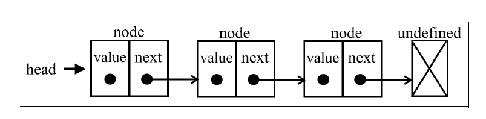
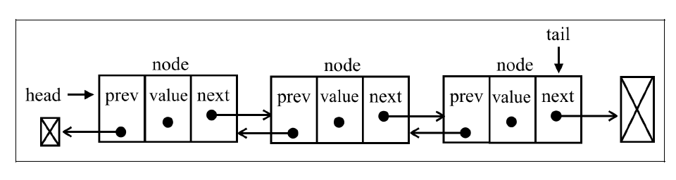

## 1. 简介

要存储多个元素，数组（或列表）可能是最常用的数据结构。正如本书之前提到的，每种语言都实现了数组。这种数据结构非常方便，提供了一个便利的[]语法来访问其元素。然而，这种数据结构有一个缺点：（在大多数语言中）数组的大小是固定的，从数组的起点或中间插入或移除项的成本很高，因为需要移动元素。（尽管我们已经学过，JavaScript 有来自 Array 类的方法可以帮我们做这些事，但背后的情况同样如此。）

链表存储有序的元素集合，但不同于数组，链表中的元素在内存中并不是连续放置的。每个元素由一个存储元素本身的节点和一个指向下一个元素的引用（也称指针或链接）组成。下图展示了一个链表的结构。



相对于传统的数组，链表的一个好处在于，添加或移除元素的时候不需要移动其他元素。然而，链表需要使用指针，因此实现链表时需要额外注意。在数组中，我们可以直接访问任何位置的任何元素，而要想访问链表中间的一个元素，则需要从起点（表头）开始迭代链表直到找到所需的元素。

### 1.1. 实现

```javascript
// Node 辅助类
class Node {
  constructor(element) {
    this.element = element;
    this.next = null;
  }
}

const LinkedList = (() => {
  // 封装私有属性
  const store = new WeakMap();

  class LinkedList {
    constructor() {
      store.set(this, { _count: 0 });
      this.head = null;
    }

    // 长度 只读
    get size() {
      return store.get(this)._count;
    }

    // 是否为空 只读
    get isEmpty() {
      return this.size === 0;
    }

    // 在链表末尾添加一个元素
    append(element) {
      const newNode = new Node(element);

      if (this.isEmpty) {
        this.head = newNode;
      } else {
        this.getNodeAt(this.size - 1).next = newNode;
      }

      store.get(this)._count += 1;

      return this;
    }

    // 在位置 index 处添加一个元素
    insert(element, index) {
      const newNode = new Node(element);

      if (index === 0) {
        newNode.next = this.head;
        this.head = newNode;
      }

      if (index >= 1 && index <= this.size) {
        newNode.next = this.getNodeAt(index);
        this.getNodeAt(index - 1).next = newNode;
      }

      store.get(this)._count += 1;
    }

    // 获取 index 位置处的节点
    getNodeAt(index) {
      if (index >= 0 && index < this.size) {
        let curNode = this.head;
        let i = 0;

        while (i < index) {
          curNode = curNode.next;
          i += 1;
        }

        return curNode;
      }

      return null;
    }

    // 移除位置 index 处的元素
    removeAt(index) {
      if (index === 0) {
        const originHeadElement = this.head?.element;
        this.head = this.getNodeAt(1);
        return originHeadElement;
      }

      if (index >= 1 && index < this.size) {
        const elementToRemove = this.getNodeAt(index).element;
        this.getNodeAt(index - 1).next = this.getNodeAt(index + 1);
        return elementToRemove;
      }

      store.get(this)._count -= 1;

      return null;
    }

    // 移除元素
    remove(element) {
      return this.removeAt(this.indexOf(element));
    }

    // 返回指定元素的位置
    indexOf(element) {
      let curNode = this.head;
      let i = 0;

      while (curNode) {
        if (curNode.element === element) {
          return i;
        }

        curNode = curNode.next;
        i += 1;
      }

      return -1;
    }

    // 默认迭代器用于展示所有元素
    [Symbol.iterator]() {
      let curNode = this.head;

      return {
        next: () => {
          const result = { value: curNode?.element, done: curNode === null };
          curNode = curNode?.next;
          return result;
        },
        [Symbol.iterator]() {
          return this;
        },
      };
    }
  }

  return LinkedList;
})();
```

### 1.2. 使用链表

```javascript
const linkedList = new LinkedList();
linkedList.append('apple').append('orange').append('pear');
console.log(...linkedList);
// -> 'apple' 'orange' 'pear'

linkedList.insert('watermelon', 3);
console.log(...linkedList);
// -> 'apple' 'orange' 'pear' 'watermelon'

console.log(linkedList.indexOf('watermelon'));
// -> 3

console.log(linkedList.getNodeAt(3).element);
// -> 'watermelon'

linkedList.removeAt(3);
console.log(...linkedList);
// -> 'apple' 'orange' 'pear'

linkedList.remove('apple');
console.log(...linkedList);
// -> 'orange' 'pear'
```

## 2. 双向链表

链表有多种不同的类型，本节介绍双向链表。双向链表和普通链表的区别在于，在链表中，一个节点只有链向下一个节点的链接；而在双向链表中，链接是双向的：一个链向下一个元素，另一个链向前一个元素，如下图所示。



### 2.1. 实现

```javascript
class Node {
  constructor(element) {
    this.element = element;
    this.pre = null;
    this.next = null;
  }
}

const DoublyLinkedList = (() => {
  const store = new WeakMap();

  class DoublyLinkedList {
    constructor() {
      this.head = null;
      this.tail = null;
      store.set(this, { _count: 0 });
    }

    // 节点数量 只读
    get size() {
      return store.get(this)._count;
    }

    // 是否为空 只读
    get isEmpty() {
      return this.size === 0;
    }

    // 在末尾添加 element
    append(element) {
      const newNode = new Node(element);

      if (this.isEmpty) {
        this.head = newNode;
        this.tail = newNode;
      } else {
        const curNode = this.tail;
        newNode.pre = curNode;
        curNode.next = newNode;

        this.tail = newNode;
      }

      store.get(this)._count += 1;

      return this;
    }

    // 在位置 index 处插入 element
    insert(element, index) {
      const newNode = new Node(element);

      if (index === 0) {
        if (this.isEmpty) {
          this.head = newNode;
          this.tail = newNode;
        } else {
          const curNode = this.head;
          newNode.next = curNode;
          curNode.pre = newNode;

          this.head = newNode;
        }
      } else if (index === this.size - 1) {
        const curNode = this.tail;
        curNode.next = newNode;
        newNode.pre = curNode;

        this.tail = newNode;
      } else {
        const curNode = this.getNodeAt(index);
        newNode.pre = curNode.pre;
        newNode.next = curNode;
        curNode.pre.next = newNode;
        curNode.pre = newNode;
      }

      store.get(this)._count += 1;
    }

    remove(element) {
      return this.removeAt(this.indexOf(element));
    }

    // 移除 index 位置处的节点
    removeAt(index) {
      const elementToRemove = this.getNodeAt(index).element;

      if (index === 0) {
        if (this.size === 1) {
          this.head = null;
          this.tail = null;
        } else {
          this.head.next.pre = null;
          this.head = this.head.next;
        }
      } else if (index === this.size - 1) {
        this.tail.pre.next = null;
      } else {
        const curNode = this.getNodeAt(index);
        curNode.next.pre = curNode.pre;
        curNode.pre.next = curNode.next;
      }

      store.get(this)._count -= 1;

      return elementToRemove;
    }

    // 返回 element 的位置
    indexOf(element) {
      let curNode = this.head;
      let i = 0;

      while (curNode) {
        if (curNode.element === element) {
          return i;
        }

        curNode = curNode.next;
        i += 1;
      }

      return -1;
    }

    // 获取位置 index 处的节点
    getNodeAt(index) {
      if (index >= 0 && index < this.size) {
        let curNode = null;
        let i = -1;

        if (index < Math.floor(this.size / 2)) {
          curNode = this.head;
          i = 0;

          while (i < index) {
            curNode = curNode.next;
            i += 1;
          }
        } else {
          curNode = this.tail;
          i = this.size - 1;

          while (i > index) {
            curNode = curNode.pre;
            i -= 1;
          }
        }

        return curNode;
      }

      return null;
    }

    // 默认迭代器用于展示所有元素
    [Symbol.iterator]() {
      let curNode = this.head;

      return {
        next: () => {
          const result = { value: curNode?.element, done: curNode === null };
          curNode = curNode?.next;
          return result;
        },
        [Symbol.iterator]() {
          return this;
        },
      };
    }
  }

  return DoublyLinkedList;
})();
```

### 2.2. 使用

```javascript
const doublyLinkedList = new DoublyLinkedList();
doublyLinkedList.append('apple').append('orange').append('pear');
doublyLinkedList.insert('watermelon', 1);
doublyLinkedList.removeAt(1);
console.log(...doublyLinkedList);
// -> 'apple' 'orange' 'pear'
```

## 3. 用链表实现栈和队列

### 3.1. 实现栈

```javascript
// ... 以上为双向链表代码
const Stack = (() => {
  const store = new WeakMap();

  class Stack {
    constructor() {
      store.set(this, { _items: new DoublyLinkedList() });
    }

    get size() {
      return store.get(this)._items.size;
    }

    get isEmpty() {
      return store.get(this)._items.isEmpty;
    }

    push(element) {
      store.get(this)._items.append(element);
      return this.size;
    }

    pop() {
      return store.get(this)._items.removeAt(this.size - 1);
    }

    peek() {
      return store.get(this)._items.getNodeAt(this.size - 1)?.element;
    }
  }

  return Stack;
})();

const stack = new Stack();

stack.push(1);

console.log(stack.size, stack.isEmpty);
// -> 1, false

console.log(stack.pop());
// -> 1

console.log(stack.isEmpty, stack.peek());
// -> true, undefined
```

### 3.2. 实现队列

```javascript
// ... 以上为双向链表代码
const Queue = (() => {
  const store = new WeakMap();

  class Queue {
    constructor() {
      store.set(this, { _items: new DoublyLinkedList() });
    }

    get size() {
      return store.get(this)._items.size;
    }

    get isEmpty() {
      return store.get(this)._items.isEmpty;
    }

    enqueue(ele) {
      store.get(this)._items.append(ele);
      return this.size;
    }

    dequeue() {
      const eleToDequeue = store.get(this)._items.getNodeAt(0).element;
      store.get(this)._items.removeAt(0);
      return eleToDequeue;
    }

    peek() {
      return store.get(this)._items.getNodeAt(0)?.element;
    }
  }

  return Queue;
})();

const queue = new Queue();
queue.enqueue(1);
console.log(queue.size, queue.isEmpty, queue.peek());
// -> 1 false 1

queue.dequeue();
console.log(queue.size, queue.isEmpty);
// -> 0 true
```