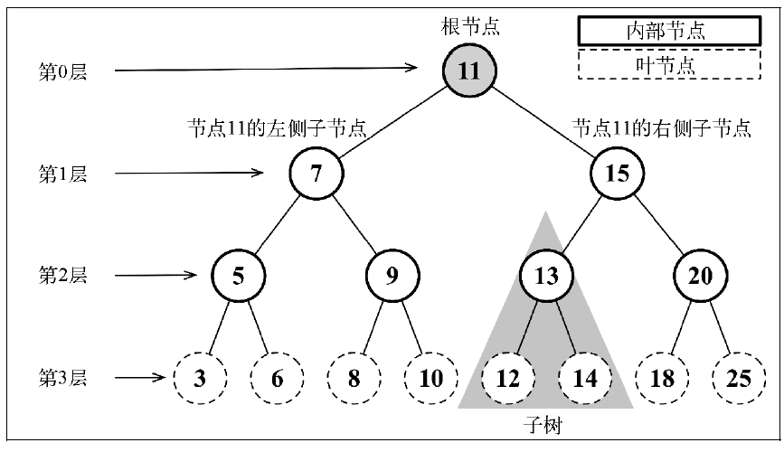
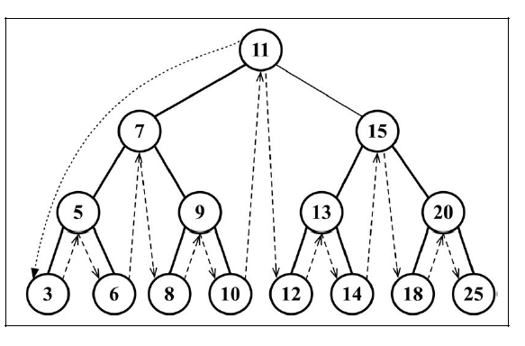
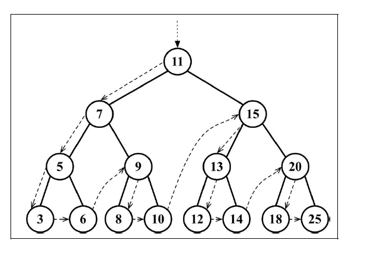
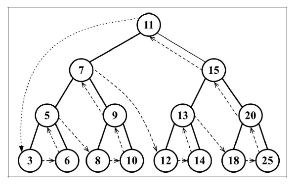

## 1. 简介

到目前为止，本书已经介绍了一些顺序数据结构，而第一个非顺序数据结构是散列表。在本章，我们将要学习另一种非顺序数据结构——树，它对于存储需要快速查找的数据非常有用。

树是一种分层数据的抽象模型。现实生活中最常见的树的例子是家谱，或是公司的组织架构图。

一个树结构包含一系列存在父子关系的节点。每个节点都有一个父节点（除了顶部的第一个节点）以及零个或多个子节点：



位于树顶部的节点叫作根节点（11）。它没有父节点。树中的每个元素都叫作节点，节点分为内部节点和外部节点。至少有一个子节点的节点称为内部节点（7、5、9、15、13 和 20 是内部节点）。没有子元素的节点称为外部节点或叶节点（3、6、8、10、12、14、18 和 25 是叶节点）。

一个节点可以有祖先和后代。一个节点（除了根节点）的祖先包括父节点、祖父节点、曾祖父节点等。一个节点的后代包括子节点、孙子节点、曾孙节点等。例如，节点 5 的祖先有节点 7 和节点 11，后代有节点 3 和节点 6。

有关树的另一个术语是子树。子树由节点和它的后代构成。例如，节点 13、12 和 14 构成了上图中树的一棵子树。

节点的一个属性是深度，节点的深度取决于它的祖先节点的数量。比如，节点 3 有 3 个祖先节点（5、7 和 11），它的深度为 3。

树的高度取决于所有节点深度的最大值。一棵树也可以被分解成层级。根节点在第 0 层，它的子节点在第 1 层，以此类推。上图中的树的高度为 3（最大高度已在图中表示——第 3 层）。现在我们知道了与树相关的一些最重要的概念，下面来学习更多有关树的知识。

## 2. 二叉搜索树

二叉树中的节点最多只能有两个子节点：一个是左侧子节点，另一个是右侧子节点。这个定义有助于我们写出更高效地在树中插入、查找和删除节点的算法。二叉树在计算机科学中的应用非常广泛。

**二叉搜索树(Binary Search Tree, BST)** 是二叉树的一种，但是只允许你在左侧节点存储（比父节点）小的值，在右侧节点存储（比父节点）大的值。上一节的图中就展现了一棵二叉搜索树。

二叉搜索树将是我们要在本章研究的数据结构。

### 2.1. 基本骨架

```javascript
class Node {
  constructor(ele) {
    this.element = ele;
    this.left = null;
    this.right = null;
  }

  onLeftOf(node) {
    return this.element - node.element < 0;
  }
}

class BinarySearchTree {
  constructor() {
    this.root = null;
  }
}
```

### 2.2. 添加节点

```javascript
// 末尾添加一个元素
append(ele) {
  const newNode = new Node(ele);

  if (this.root) {
    const newNode = new Node(ele);

    (function appendAt(curNode) {
      if (newNode.onLeftOf(curNode)) {
        if (curNode.left === null) curNode.left = newNode;
        else appendAt(curNode.left);
      } else if (curNode.right === null) curNode.right = newNode;
      else appendAt(curNode.right);
    }(this.root));
  } else {
    this.root = newNode;
  }

  return this;
}
```

```javascript
// ...
const bst = new BinarySearchTree();
bst.append(11).append(7).append(15).append(9).append(3);

console.log(bst);
```

### 2.3. 遍历

遍历一棵树是指访问树的每个节点并对它们进行某种操作的过程。但是我们应该怎么去做呢？应该从树的顶端还是底端开始呢？从左开始还是从右开始呢？访问树的所有节点有三种方式：中序、先序和后序。

在后面，我们将会深入了解这三种遍历方式的用法和实现。

- 中序遍历

中序遍历是一种以上行顺序访问 BST 所有节点的遍历方式，也就是以从最小到最大的顺序访问所有节点。中序遍历的一种应用就是对树进行排序操作。



```javascript
// 中序遍历
inOrderTraverse(callback) {
  (function traverseAt(curNode) {
    if (curNode) {
      traverseAt(curNode.left);
      callback(curNode.element);
      traverseAt(curNode.right);
    }
  }(this.root));
}
```

```javascript
// ...
const bst = new BinarySearchTree();
[11, 7, 15, 5, 3, 6, 9, 8, 10, 13, 12, 14, 20, 18, 25].forEach((ele) =>
  bst.append(ele),
);

const stack = [];

bst.inOrderTraverse((ele) => stack.push(ele));
console.log(...stack);
// -> 3 5 6 7 8 9 10 11 12 13 14 15 18 20 25
```

- 先序遍历

先序遍历是以优先于后代节点的顺序访问每个节点的。先序遍历的一种应用是打印一个结构化的文档。



```javascript
// 先序遍历
preOrderTraverse(callback) {
  (function traverseAt(curNode) {
    if (curNode) {
      callback(curNode.element);
      traverseAt(curNode.left);
      traverseAt(curNode.right);
    }
  }(this.root));
}
```

```javascript
// ...
const bst = new BinarySearchTree();
[11, 7, 15, 5, 3, 6, 9, 8, 10, 13, 12, 14, 20, 18, 25].forEach((ele) =>
  bst.append(ele),
);

const stack = [];

bst.preOrderTraverse((ele) => stack.push(ele));
console.log(...stack);
// -> 11 7 5 3 6 9 8 10 15 13 12 14 20 18 25
```

- 后序遍历

后序遍历则是先访问节点的后代节点，再访问节点本身。后序遍历的一种应用是计算一个目录及其子目录中所有文件所占空间的大小。



```javascript
// 后序遍历
postOrderTraverse(callback) {
  (function traverseAt(curNode) {
    if (curNode) {
      traverseAt(curNode.left);
      traverseAt(curNode.right);
      callback(curNode.element);
    }
  }(this.root));
}
```

```javascript
// ...
const bst = new BinarySearchTree();
[11, 7, 15, 5, 3, 6, 9, 8, 10, 13, 12, 14, 20, 18, 25].forEach((ele) =>
  bst.append(ele),
);

const stack = [];

bst.postOrderTraverse((ele) => stack.push(ele));
console.log(...stack);
// -> 3 6 5 8 10 9 7 12 14 13 18 25 20 15 11
```

### 2.4. 搜索

#### 2.4.1. 极值

在二叉搜索树中找到极值是很容易的事情。因为最小值在树的左下方，而最大值在树的右下方。

下面我们就实现 min 和 max 方法。他们分别返回最小值和最大值。

- min()

```javascript
min() {
  let curNode = this.root;

  while(curNode.left) {
    curNode = curNode.left;
  }

  return curNode.element;
}
```

- max()

```javascript
max() {
  let curNode = this.root;

  while(curNode.right) {
    curNode = curNode.right;
  }

  return curNode.element;
}
```

```javascript
// ...
const bst = new BinarySearchTree();
[11, 7, 15, 5, 3, 6, 9, 8, 10, 13, 12, 14, 20, 18, 25].forEach((ele) =>
  bst.append(ele),
);

console.log(bst.min(), bst.max());
// -> 3, 25
```

#### 2.4.2. 特定值

contains() 方法用于搜索一个值是否存在于树中。

```javascript
// 包含特定值？
contains(ele) {
  const nodeToSearch = new Node(ele);

  return (function searchAt(curNode) {
    if (curNode) {
      if (nodeToSearch.element < curNode.element) {
        return searchAt(curNode.left);
      }
      if (nodeToSearch.element > curNode.element) {
        return searchAt(curNode.right);
      }
      return true;
    }

    return false;
  }(this.root));
}
```

```javascript
const bst = new BinarySearchTree();
[11, 7, 15, 5, 3, 6, 9, 8, 10, 13, 12, 14, 20, 18, 25].forEach((ele) => bst.append(ele));

console.log(bst.contains(8));
// -> true

console.log(bst.constains(4));
// -> false
```

### 2.5. 移除节点

我们要为BST 实现的下一个、也是最后一个方法是remove 方法。这是我们在本书中要实现的最复杂的方法。

```javascript

```

## 3. 自平衡树

### 3.1. AVL 树

### 3.2. 红黑树

